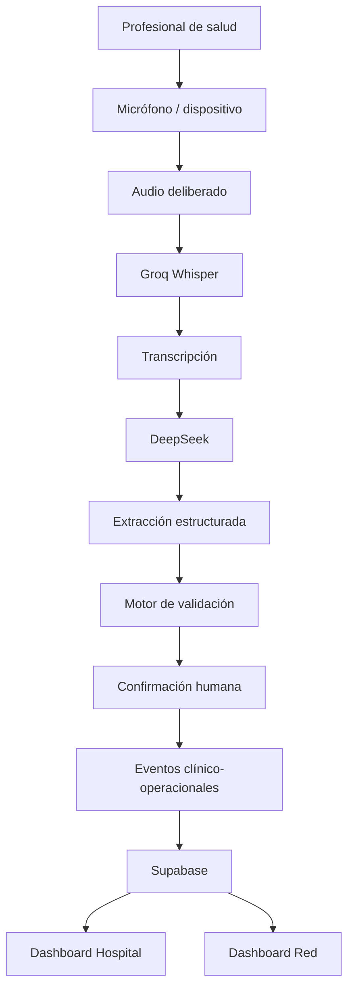

# SIRENA

### HaCAithon 2026 — Salud Pública

> **Que el profesional atienda al paciente; que SIRENA actualice la red.**

SIRENA es un prototipo desarrollado para **HaCAithon 2026** que utiliza inteligencia artificial para transformar registros de voz deliberados de profesionales de salud en **información clínico-operacional estructurada, validada y disponible en tiempo real** para apoyar la gestión hospitalaria y de red.

La propuesta no busca crear camas, reemplazar decisiones médicas ni sustituir los sistemas actuales del Ministerio de Salud.

Busca resolver un problema anterior:

> **La información clínica ya existe cuando el profesional toma una decisión. SIRENA busca reducir el tiempo y la fricción necesarios para convertir esa decisión en información operacional utilizable.**

---

# 1. El problema

Cuando un paciente necesita hospitalización, una decisión clínica como:

> “Paciente masculino de 72 años con insuficiencia respiratoria. Se indica hospitalización y requerimiento de UCI.”

contiene información que también es relevante operacionalmente:

- requiere hospitalización;
- requiere determinada capacidad;
- puede necesitar UCI o UTI;
- puede requerir aislamiento;
- puede necesitar determinada especialidad;
- representa nueva demanda para el hospital y potencialmente para la red.

El problema que aborda SIRENA es la separación que puede existir entre:

```text
DECISIÓN CLÍNICA
       ↓
INFORMACIÓN GENERADA
       ↓
TRANSFORMACIÓN A DATOS OPERACIONALES
       ↓
SISTEMA HOSPITALARIO
       ↓
GESTIÓN DE RED
```

Nuestra hipótesis es que esa separación puede producir:

- latencia;
- duplicación de información;
- tareas administrativas;
- información incompleta;
- eventos omitidos;
- menor visibilidad de la demanda;
- menor visibilidad de la capacidad efectiva;
- necesidad de validaciones adicionales.

SIRENA intenta reducir esa distancia.

---

# 2. Contexto: UGCC

Chile ya cuenta con una infraestructura nacional para apoyar la coordinación de pacientes y capacidad hospitalaria:

**Unidad de Gestión Centralizada de Casos (UGCC), Ministerio de Salud.**

UGCC permite coordinar casos considerando elementos como:

- necesidad clínica;
- disponibilidad de camas;
- capacidad resolutiva;
- recursos de los establecimientos;
- posibilidades de derivación dentro de la red.

## SIRENA no reemplaza UGCC

Este punto es fundamental.

SIRENA no propone construir una nueva UGCC.

La propuesta es intervenir antes:

```text
ATENCIÓN CLÍNICA
       ↓
    SIRENA
       ↓
INFORMACIÓN ESTRUCTURADA
       ↓
SISTEMA HOSPITALARIO
       ↓
GESTIÓN DE RED / UGCC
```

La innovación está en mejorar la forma en que la información se captura, estructura y vuelve operacionalmente disponible.

---

# 3. Propuesta de valor

SIRENA transforma:

```text
VOZ CLÍNICA DELIBERADA
        ↓
TRANSCRIPCIÓN
        ↓
COMPRENSIÓN CON IA
        ↓
EVENTOS ESTRUCTURADOS
        ↓
VALIDACIÓN HUMANA
        ↓
ACTUALIZACIÓN HOSPITALARIA
        ↓
VISIBILIDAD DE RED
```

En vez de pedir que información ya expresada por un profesional sea posteriormente reinterpretada y convertida nuevamente en datos, SIRENA intenta estructurarla **en el momento en que se genera**.

---

# 4. Qué hace SIRENA

Un profesional registra deliberadamente información relacionada con un paciente.

Por ejemplo:

```text
Paciente masculino de 72 años con insuficiencia respiratoria.
Se indica hospitalización y requerimiento de UCI.
```

SIRENA:

1. captura el audio;
2. lo transforma a texto;
3. analiza semánticamente la transcripción;
4. identifica eventos clínico-operacionales;
5. diferencia eventos confirmados de posibles o condicionales;
6. presenta la interpretación al profesional;
7. requiere confirmación humana;
8. publica los eventos confirmados;
9. actualiza la información hospitalaria;
10. refleja el cambio en las vistas de hospital y red.

---

# 5. Principio de seguridad

SIRENA no está diseñado para tomar decisiones clínicas autónomas.

La IA propone.

El profesional valida.

```text
IA → PROPONE
HUMANO → CONFIRMA
SISTEMA → ACTUALIZA
```

Esto es especialmente importante para conceptos clínicos que contienen:

- negación;
- incertidumbre;
- temporalidad;
- condicionalidad;
- probabilidad.

Por ejemplo:

```text
“Probablemente requiera UCI si empeora.”
```

NO debe transformarse automáticamente en:

```text
UCI requerida
```

SIRENA debe interpretarlo como algo equivalente a:

```text
Posible requerimiento UCI
Estado: condicional
Pendiente de confirmación
```

Por eso SIRENA no es simplemente un sistema de dictado.

El objetivo es interpretar el significado operacional del lenguaje clínico manteniendo **human-in-the-loop** para los eventos críticos.

---

# 6. Arquitectura

## Flujo principal



---

# 7. Pipeline implementado

El pipeline actual del prototipo es:

```text
AUDIO
  ↓
POST /api/transcribe
  ↓
GROQ WHISPER
  ↓
TRANSCRIPCIÓN
  ↓
POST /api/structure
  ↓
DEEPSEEK
  ↓
EVENTOS ESTRUCTURADOS
  ↓
VALIDACIÓN HUMANA
  ↓
CONFIRMAR Y PUBLICAR
  ↓
SUPABASE REALTIME
  ↓
HOSPITAL + RED
```

## Speech-to-Text

Endpoint:

```text
POST /api/transcribe
```

Tecnología:

```text
Groq Whisper
```

Responsabilidad:

```text
audio → texto
```

## Estructuración mediante IA

Endpoint:

```text
POST /api/structure
```

Tecnología:

```text
DeepSeek
```

Responsabilidad:

```text
texto clínico → información clínico-operacional estructurada
```

La IA debe reconocer especialmente diferencias entre:

```text
UCI confirmada
UCI posible
UCI condicional
UCI negada
```

y no convertir automáticamente incertidumbre en una decisión clínica confirmada.

---

# 8. Supabase y actualización en tiempo real

Después de la confirmación del profesional, los eventos son publicados al sistema.

La persistencia y sincronización utilizan:

```text
Supabase
+
Supabase Realtime
```

Esto permite que una confirmación realizada desde la interfaz del profesional pueda verse reflejada inmediatamente en:

```text
/registro
    ↓
Supabase
    ↓
/hospital
    ↓
/red
```

---

# 9. Las tres interfaces de SIRENA

SIRENA representa tres niveles distintos del sistema sanitario.

## Nivel 1 — Profesional

Ruta web:

```text
/registro
```

También existe una implementación móvil en:

```text
mobile/
```

La interfaz permite:

- registrar audio;
- visualizar la transcripción;
- revisar la interpretación realizada por IA;
- revisar eventos detectados;
- identificar eventos inciertos;
- confirmar información;
- publicar el resultado.

El profesional mantiene el control de la información crítica.

## Nivel 2 — Hospital

Ruta:

```text
/hospital
```

Representa la consola operacional de un establecimiento.

Permite visualizar, entre otros elementos:

### Capacidad efectiva

```text
UCI
UTI
Camas básicas
```

### Demanda

```text
Pacientes esperando UCI
Pacientes esperando UTI
Pacientes esperando cama básica
```

### Eventos

También pueden mostrarse eventos relacionados con:

- hospitalización;
- altas;
- cambios de estado;
- capacidad;
- requerimientos pendientes de validación.

Para la demostración, **Hospital Barros Luco representa Hospital A**.

## Nivel 3 — Red

Ruta:

```text
/red
```

Representa una vista agregada de distintos hospitales.

Ejemplo conceptual:

```text
HOSPITAL A

Demanda UCI:      5
Capacidad:        2
Balance:         -3


HOSPITAL B

Demanda UCI:      1
Capacidad:        4
Balance:         +3
```

Esto permite visualizar déficits, superávits y posibles oportunidades de derivación de forma informativa.

---

# 10. Capacidad efectiva

SIRENA no se limita al concepto de “cama física”.

Una cama existente no implica necesariamente capacidad disponible.

Ejemplo:

```text
Hospital tiene 10 camas UCI físicas.

1 fuera de servicio
1 sin recurso humano suficiente
8 operativas
```

Entonces:

```text
Capacidad física = 10
Capacidad efectiva = 8
```

Dependiendo del caso, la capacidad efectiva podría considerar:

- personal;
- equipamiento;
- ventilación;
- aislamiento;
- especialidad;
- infraestructura;
- restricciones clínicas.

Estas dimensiones deben ser validadas clínicamente antes de utilizarse en un sistema real.

---

# 11. Eventos clínico-operacionales

La arquitectura puede trabajar con eventos estructurados como:

```text
PATIENT_REQUIRES_HOSPITALIZATION

PATIENT_POSSIBLE_ICU_REQUIREMENT

PATIENT_ICU_CONFIRMED

PATIENT_DISCHARGE_ORDERED

PATIENT_DISCHARGED

BED_CLEANING

BED_AVAILABLE

CAPACITY_UNAVAILABLE

TRANSFER_REQUIRED
```

Los nombres son conceptuales.

La idea importante es representar cambios clínico-operacionales como eventos estructurados que puedan actualizar el estado del hospital y eventualmente de la red.

---

# 12. Tecnologías utilizadas

## Frontend

- Aplicación web
- Interfaz profesional
- Dashboard hospitalario
- Dashboard de red
- Expo para aplicación móvil

## Backend / APIs

- API de transcripción
- API de estructuración clínica
- lógica de validación;
- publicación de eventos;
- sincronización de estados.

## Inteligencia Artificial

### Groq Whisper

Utilizado para:

```text
Speech-to-Text
```

### DeepSeek

Utilizado para:

```text
comprensión semántica
+
extracción estructurada
+
detección de incertidumbre
+
clasificación de eventos
```

## Base de datos

```text
Supabase
```

## Tiempo real

```text
Supabase Realtime
```

---

# 13. Base de datos

Los scripts SQL del proyecto se encuentran en:

```text
supabase/001_up.sql
supabase/002_rls.sql
supabase/003_seed.sql
```

Los tipos compartidos de base de datos se encuentran en:

```text
shared/database.types.ts
```

---

# 14. Diseño

Las definiciones y decisiones visuales del proyecto se encuentran en:

```text
design.md
```

---

# 15. Datos del prototipo

La demostración utiliza exclusivamente **datos sintéticos**.

El dataset incluye ocho hospitales sintéticos de la Región Metropolitana.

Pacientes de demostración:

```text
PAC-29381
PAC-29382
PAC-29383
PAC-29384
```

Profesional utilizado en la demo:

```text
E. Riquelme
```

No se utilizan datos clínicos reales.

---

# 16. Demo principal

La demo está diseñada para mostrar el flujo completo de SIRENA.

## Escena 1 — Hospital

Abrir:

```text
/hospital
```

Se observa la capacidad efectiva y demanda actual.

Ejemplo:

```text
Hospital Barros Luco

UCI disponibles: 1
Pacientes esperando UCI: 1
```

## Escena 2 — Registro

Abrir:

```text
/registro
```

El profesional registra:

> “Paciente masculino de 72 años con insuficiencia respiratoria. Se indica hospitalización y requerimiento de UCI.”

## Escena 3 — Speech-to-Text

Groq Whisper genera la transcripción.

## Escena 4 — IA

DeepSeek estructura la información.

Ejemplo:

```text
Paciente adulto
Hospitalización: sí
UCI: confirmada
Diagnóstico relevante: insuficiencia respiratoria
```

## Escena 5 — Validación

El profesional revisa el resultado y selecciona:

```text
CONFIRMAR Y PUBLICAR
```

## Escena 6 — Hospital

El dashboard se actualiza mediante Supabase Realtime.

```text
Pacientes esperando UCI

1 → 2
```

## Escena 7 — Red

Abrir:

```text
/red
```

La red ahora refleja el nuevo déficit del hospital.

Otro establecimiento puede mostrar capacidad disponible.

SIRENA puede visualizar una:

```text
Posible derivación
```

Esta recomendación es **informativa** y no constituye una decisión clínica autónoma.

---

# 17. Demo de incertidumbre

La segunda demostración prueba que SIRENA no es simplemente Speech-to-Text.

El profesional dice:

> “Probablemente requiera UCI si empeora.”

SIRENA debe generar algo equivalente a:

```text
UCI: possible
Condición: conditional
Confirmación: pendiente
```

No:

```text
ICU_CONFIRMED
```

Esta demostración permite mostrar:

- NLP;
- comprensión semántica;
- detección de incertidumbre;
- seguridad;
- human-in-the-loop;
- diferenciación frente a un dictado convencional.

---

# 18. Privacidad

El diseño de SIRENA parte de un principio:

> **El micrófono no está escuchando permanentemente.**

El profesional activa deliberadamente el registro.

Pipeline:

```text
ACTIVACIÓN
    ↓
AUDIO
    ↓
TRANSCRIPCIÓN
    ↓
EXTRACCIÓN
    ↓
DATOS ESTRUCTURADOS
```

En el prototipo:

```text
NO se persiste el audio.
```

Una implementación futura debería considerar:

- minimización de datos;
- eliminación del audio;
- cifrado;
- autenticación;
- autorización por roles;
- trazabilidad;
- auditoría;
- separación de identidad;
- interoperabilidad segura.

No se afirma cumplimiento regulatorio clínico o sanitario para el prototipo de hackathon.

---

# 19. Variables de entorno

El proyecto utiliza servicios externos que requieren credenciales.

Crear un archivo:

```bash
.env.local
```

o utilizar el archivo de entorno definido por la configuración del proyecto.

Las variables exactas deben corresponder a los nombres implementados en el repositorio.

Ejemplo conceptual:

```env
# Supabase
NEXT_PUBLIC_SUPABASE_URL=
NEXT_PUBLIC_SUPABASE_ANON_KEY=
SUPABASE_SERVICE_ROLE_KEY=

# Groq
GROQ_API_KEY=

# DeepSeek
DEEPSEEK_API_KEY=
```

> **Importante:** no subir credenciales reales al repositorio.

Agregar los archivos de entorno a:

```text
.gitignore
```

---

# 20. Instalación

## Clonar repositorio

```bash
git clone <URL_DEL_REPOSITORIO>
```

Entrar al proyecto:

```bash
cd <NOMBRE_DEL_REPOSITORIO>
```

## Instalar dependencias

Usar el package manager definido por el repositorio.

Por ejemplo:

```bash
npm install
```

## Configurar variables de entorno

Crear:

```bash
.env.local
```

y completar las credenciales necesarias.

## Configurar Supabase

Ejecutar en orden:

```text
supabase/001_up.sql
supabase/002_rls.sql
supabase/003_seed.sql
```

## Ejecutar aplicación

Por ejemplo:

```bash
npm run dev
```

Luego abrir la URL local indicada por el framework.

---

# 21. Rutas principales

| Nivel | Ruta |
|---|---|
| Profesional | `/registro` |
| Hospital | `/hospital` |
| Red | `/red` |

La aplicación móvil se encuentra en:

```text
mobile/
```

---

# 22. Qué NO construye el MVP

Para mantener el proyecto viable dentro del tiempo de la hackathon, SIRENA deliberadamente deja fuera:

- wearable físico real;
- integración real con MINSAL;
- integración productiva con UGCC;
- matching autónomo paciente-hospital;
- decisiones clínicas automáticas;
- login clínico productivo;
- almacenamiento permanente de audio;
- interoperabilidad clínica completa;
- despliegue hospitalario real.

Estas funciones corresponden a posibles evoluciones futuras.

---

# 23. MVP

El MVP se concentra en demostrar una sola tesis:

> **voz → información estructurada → validación → hospital → red**

El prototipo debe probar que una decisión expresada por un profesional puede convertirse en un evento estructurado y reflejarse rápidamente en la vista operacional.

---

# 24. Impacto que debería medirse

SIRENA no afirma resultados clínicos que todavía no hayan sido medidos.

Las métricas propuestas para una validación real incluyen:

- tiempo desde decisión clínica hasta registro estructurado;
- porcentaje de eventos correctamente capturados;
- tasa de eventos omitidos;
- precisión de extracción;
- sensibilidad para eventos críticos;
- falsos positivos;
- tiempo dedicado a digitación;
- número de correcciones realizadas por profesionales;
- tiempo de actualización de capacidad;
- tiempo hasta identificar una opción de derivación;
- utilización de capacidad disponible.

---

# 25. Innovación

La innovación de SIRENA no es:

```text
usar un LLM
```

ni:

```text
usar Speech-to-Text
```

ni:

```text
crear un dashboard.
```

La innovación está en:

> **convertir lenguaje clínico no estructurado en eventos operacionales estructurados que permitan mantener sincronizada la visión de demanda y capacidad hospitalaria.**

Speech-to-Text y los modelos de lenguaje son componentes tecnológicos.

El producto es la **captura automática y validada del estado clínico-operacional**.

---

# 26. Visión

Hoy:

```text
Profesional
   ↓
Decisión clínica
   ↓
Información
   ↓
Procesos posteriores
   ↓
Dato operacional
   ↓
Hospital / red
```

Con SIRENA:

```text
Profesional
   ↓
Decisión clínica
   ↓
Voz
   ↓
IA
   ↓
Información estructurada
   ↓
Validación
   ↓
Hospital
   ↓
Red
```

La visión es que:

> **la situación operacional de la red asistencial pueda convertirse en un reflejo cada vez más cercano de lo que está ocurriendo clínicamente dentro de sus hospitales.**

---

# 27. Recursos y links útiles

## Demo / YouTube

https://youtu.be/8Jj4SLXxw7Q

## Presentación

```text
Agregar aquí link a la PPT de SIRENA.
```

## Ministerio de Salud — UGCC

https://www.minsal.cl/unidad-de-gestion-centralizada-de-casos-ugcc-division-de-gestion-de-la-red-asistencial-subsecretaria-de-redes-asistenciales/

## Referencia periodística — La Tercera

https://www.latercera.com/la-tercera-domingo/noticia/como-funciona-la-ugcc-diagnostico-del-pulmon-de-la-red-de-camas/OEEVL2OPM5HQXKT6V7ZPDVMPAY/

---

# 28. Fuentes

El problema y la arquitectura conceptual fueron construidos considerando evidencia pública disponible sobre UGCC.

Entre las principales referencias:

1. **Ministerio de Salud de Chile — Unidad de Gestión Centralizada de Casos (UGCC).**
2. **MINSAL — Unidad de Gestión Centralizada de Camas, período enero 2014 – diciembre 2017.**
3. **La Tercera — “Cómo funciona la UGCC: diagnóstico del pulmón de la red de camas”.**

Las fuentes históricas se utilizan como evidencia de desafíos de integración y coordinación documentados previamente y no como afirmación de que todos los procesos descritos continúan exactamente iguales actualmente.

---

# 29. Principio final

SIRENA no busca reemplazar al profesional.

No busca reemplazar al hospital.

No busca reemplazar UGCC.

Busca conectar mejor la información entre ellos.

> **Que el profesional atienda al paciente; que SIRENA actualice la red.**
