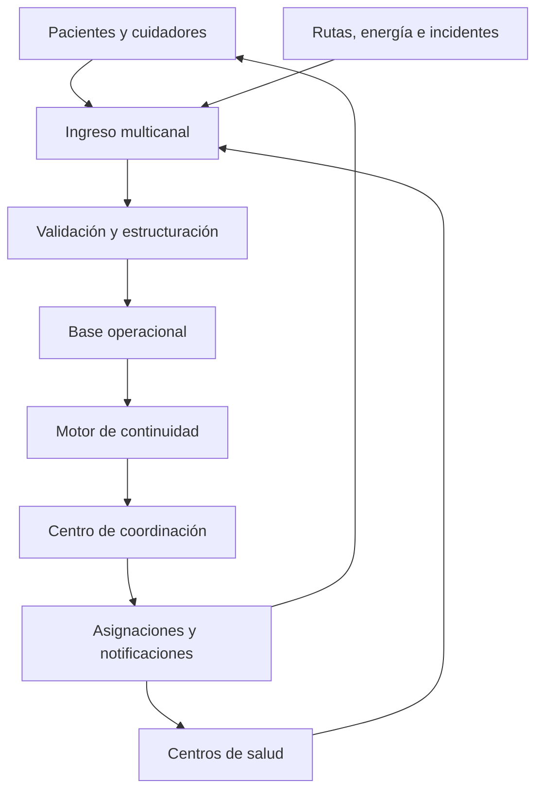
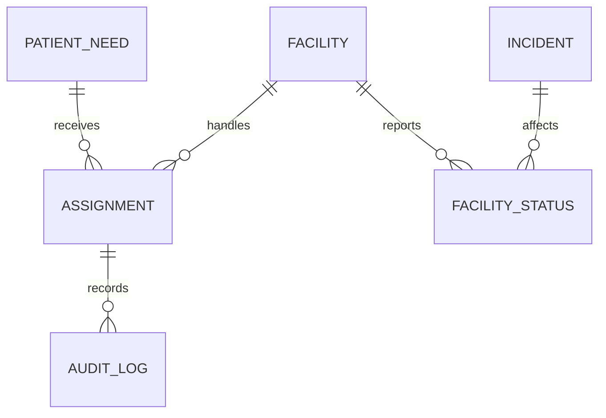
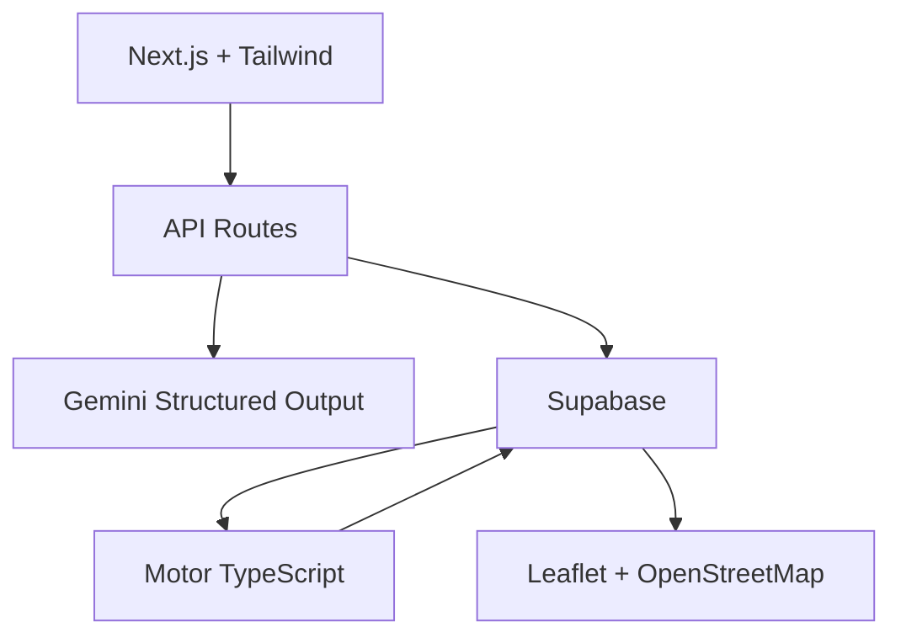

[Seguro] Una arquitectura no genera valor por tener un mapa o IA; genera valor si reduce el tiempo entre **“se interrumpió un tratamiento”** y **“alguien asumió una acción concreta para proteger al paciente”**.

# SIRENA

[Probable] La propuesta de valor central sería:

> **Dar a los coordinadores sanitarios una visión actualizada de qué pacientes no pueden esperar, qué capacidad sigue disponible y qué acción debe coordinarse antes de que se interrumpa un tratamiento crítico.**

## Arquitectura funcional



## 1. Fuentes de información

### Pacientes y cuidadores

[Probable] El paciente podría informar:

* ubicación actual;
* estado de contacto;
* necesidad de tratamiento;
* autonomía del equipo de respaldo;
* posibilidad de trasladarse;
* necesidad de acompañamiento o transporte.

[Seguro] El sistema no debería pedir diagnósticos completos ni antecedentes innecesarios.

### Centros de salud

[Probable] Cada unidad de diálisis o establecimiento informaría:

* estado operacional;
* disponibilidad de agua y electricidad;
* autonomía del generador;
* personal disponible;
* cupos disponibles;
* servicios suspendidos;
* accesos bloqueados.

### Información territorial

[Probable] El sistema podría incorporar:

* cortes eléctricos;
* caminos bloqueados;
* zonas aisladas;
* infraestructura dañada;
* recursos de transporte;
* generadores disponibles.

[Seguro] En el MVP esta información debe ingresarse manualmente o mediante datos simulados. No deben afirmar que tienen integración con SENAPRED, MINSAL, empresas eléctricas o registros clínicos si no cuentan con ella.

## 2. Capa de ingreso multicanal

[Probable] Una implementación real debería admitir:

* aplicación web liviana;
* WhatsApp;
* SMS;
* llamadas registradas por operadores;
* formulario offline para funcionarios en terreno;
* carga institucional de archivos.

[Seguro] Para la hackathon basta con dos formularios web:

1. actualización de paciente o cuidador;
2. actualización de establecimiento.

[Probable] Cada entrada podría aceptar texto libre:

> “Quedan cuatro horas de generador, no tenemos agua y el acceso norte está bloqueado”.

## 3. IA para estructurar información

[Probable] Gemini u otro modelo podría convertir el mensaje anterior en un objeto estructurado:

```json
{
  "power_status": "backup",
  "backup_hours": 4,
  "water_status": "unavailable",
  "north_access": "blocked",
  "confidence": "pending_verification"
}
```

[Seguro] El valor de esta capa no es “usar IA”, sino ahorrar al coordinador la lectura y digitación manual de múltiples mensajes.

[Seguro] La IA no debería:

* establecer gravedad clínica;
* diagnosticar;
* decidir quién recibe tratamiento;
* descartar pacientes;
* verificar por sí sola que un reporte es verdadero.

[Probable] Toda actualización procesada por IA debe pasar por una confirmación humana antes de modificar el estado operacional.

## 4. Base operacional

[Probable] La base de datos tendría cinco entidades principales:



### PatientNeed

```ts
interface PatientNeed {
  id: string;
  anonymousCode: string;
  needType: "DIALYSIS" | "ELECTRIC_SUPPORT";
  clinicalPriority: "DEFINED_BY_PROVIDER";
  nextRequiredAttention: string;
  backupHoursRemaining: number | null;
  currentZone: string;
  mobility: "INDEPENDENT" | "REQUIRES_TRANSPORT";
  contactStatus: "PENDING" | "CONTACTED" | "UNREACHABLE";
  caseStatus: "OPEN" | "ASSIGNED" | "RESOLVED";
}
```

### FacilityStatus

```ts
interface FacilityStatus {
  facilityId: string;
  operationalStatus: "OPEN" | "PARTIAL" | "CLOSED";
  availableCapacity: number;
  electricity: "GRID" | "BACKUP" | "NONE";
  backupHours: number | null;
  waterAvailable: boolean;
  accessStatus: "ACCESSIBLE" | "RESTRICTED" | "BLOCKED";
  updatedAt: string;
  verificationStatus: "PENDING" | "VERIFIED";
}
```

### Assignment

```ts
interface Assignment {
  id: string;
  patientNeedId: string;
  facilityId: string | null;
  actionType: "CONTACT" | "TRANSPORT" | "GENERATOR" | "TRANSFER";
  responsibleTeam: string;
  status: "PROPOSED" | "APPROVED" | "IN_PROGRESS" | "COMPLETED";
  createdAt: string;
}
```

[Seguro] Para la demostración deben utilizar exclusivamente datos ficticios.

## 5. Motor de continuidad

[Seguro] El motor no debe calcular prioridad clínica. Esa prioridad debe venir previamente definida por profesionales de salud.

[Probable] El motor podría calcular un **riesgo operacional de interrupción**, utilizando reglas transparentes:

```text
riesgo operacional =
    proximidad del próximo tratamiento
  + baja autonomía del equipo
  + falta de contacto
  + imposibilidad de traslado
  + centro habitual no operativo
  + ausencia de alternativa asignada
```

[Probable] Una regla podría ser:

```ts
if (
  patient.nextRequiredAttention <= nowPlusHours(8) &&
  patient.caseStatus === "OPEN" &&
  usualFacility.operationalStatus === "CLOSED"
) {
  createOperationalAlert("Tratamiento próximo sin alternativa asignada");
}
```

[Seguro] La alerta no diría “este paciente debe ser atendido primero”. Diría:

> “Este caso se aproxima a una interrupción y todavía no tiene una acción asignada”.

### Matching operacional

[Probable] Entre pacientes previamente habilitados clínicamente, el sistema podría buscar establecimientos compatibles según:

* prestación requerida;
* cupos disponibles;
* estado operacional;
* tiempo restante;
* accesibilidad;
* disponibilidad de transporte;
* autonomía de energía.

[Seguro] Toda propuesta de traslado debe ser aprobada por el coordinador correspondiente.

## 6. Centro de coordinación

[Probable] El dashboard principal debería responder cinco preguntas:

1. ¿Quién necesita una acción próximamente?
2. ¿Qué establecimientos siguen funcionando?
3. ¿Dónde queda capacidad disponible?
4. ¿Qué casos todavía no tienen responsable?
5. ¿Qué cambió durante los últimos minutos?

### Indicadores superiores

[Probable] Mostraría:

* pacientes críticos registrados;
* pacientes contactados;
* casos sin alternativa;
* establecimientos cerrados o parciales;
* cupos disponibles;
* acciones pendientes;
* actualizaciones sin verificar.

### Vista territorial

[Probable] El mapa mostraría:

* establecimientos;
* estado operacional;
* concentración agregada de necesidades;
* caminos bloqueados;
* recursos disponibles.

[Seguro] La ubicación exacta de pacientes no debería ser pública. Solo podrían verla usuarios autorizados que realmente la necesiten.

### Cola de acciones

[Probable] La cola sería más importante que el mapa:

| Caso           | Motivo de alerta                 | Acción sugerida         | Responsable        | Estado    |
| -------------- | -------------------------------- | ----------------------- | ------------------ | --------- |
| Paciente D-014 | Diálisis próxima; centro cerrado | Buscar cupo alternativo | Coordinación renal | Pendiente |
| Paciente E-008 | Dos horas de batería             | Asignar generador       | Equipo municipal   | En curso  |
| Centro Norte   | Sin agua; 12 pacientes afectados | Redistribuir agenda     | Servicio de Salud  | Pendiente |

[Seguro] El valor está en que cada problema tenga responsable y estado, no solamente un pin.

## 7. Notificaciones y cierre del ciclo

[Probable] Cuando el coordinador aprueba una acción, el sistema podría:

* avisar al paciente;
* confirmar si puede asistir;
* avisar al establecimiento receptor;
* solicitar transporte;
* reservar capacidad;
* registrar el resultado.

[Probable] Un caso se consideraría resuelto cuando exista evidencia de que la continuidad fue protegida, no cuando el mensaje haya sido enviado.

## Valor generado por componente

| Componente                 | Problema que reduce                                                             | Valor asociado                                             |
| -------------------------- | ------------------------------------------------------------------------------- | ---------------------------------------------------------- |
| Ingreso multicanal         | [Probable] Información dispersa entre llamadas y mensajes.                      | [Probable] Menor tiempo para consolidar la situación.      |
| IA estructuradora          | [Probable] Funcionarios deben leer y transcribir actualizaciones.               | [Probable] Menor carga administrativa y mayor velocidad.   |
| Estado de establecimientos | [Probable] Se intenta derivar a centros sin capacidad.                          | [Probable] Mejor uso de la capacidad todavía operativa.    |
| Motor de continuidad       | [Probable] Los casos se revisan manualmente y algunos pueden quedar invisibles. | [Probable] Detección temprana de interrupciones próximas.  |
| Matching                   | [Probable] Capacidad y necesidades se gestionan separadamente.                  | [Probable] Reasignación más rápida de atención y recursos. |
| Cola de acciones           | [Probable] No queda claro quién debe hacerse cargo.                             | [Probable] Responsabilidad, seguimiento y cierre.          |
| Auditoría                  | [Probable] Es difícil reconstruir decisiones posteriores.                       | [Probable] Transparencia y aprendizaje institucional.      |
| Múltiples canales          | [Probable] Una aplicación excluye a usuarios sin datos o smartphone.            | [Probable] Mayor cobertura y menor sesgo digital.          |

## Métricas de impacto

[Seguro] No deberían prometer “salvar vidas” sin evidencia. Deben comprometerse con métricas operacionales observables:

* tiempo desde una interrupción hasta su registro;
* porcentaje de pacientes contactados;
* cantidad de casos próximos a interrupción sin responsable;
* tiempo desde alerta hasta asignación;
* capacidad sanitaria disponible versus utilizada;
* casos derivados correctamente;
* reportes pendientes de verificación;
* casos cerrados con confirmación.

[Probable] La métrica norte sería:

> **Porcentaje de pacientes críticos cuya continuidad queda protegida antes de vencer su ventana operacional.**

## Arquitectura técnica del MVP



[Probable] El stack recomendable sería:

* Next.js y TypeScript;
* Tailwind CSS;
* Supabase para datos compartidos;
* Gemini para estructurar actualizaciones;
* motor determinístico en TypeScript;
* Leaflet y OpenStreetMap;
* Vercel para desplegar.

[Seguro] Gemini debe ser opcional. Si falla, el usuario debe poder completar manualmente el formulario estructurado.

[Seguro] Para la hackathon no deberían implementar:

* integración con registros reales;
* autenticación clínica compleja;
* predicción médica;
* conexión con ambulancias;
* historia clínica;
* personas desaparecidas;
* medicamentos;
* notificaciones reales masivas.

## Demostración de valor

[Probable] La mejor demostración sería una secuencia de cuatro minutos:

1. un centro de diálisis pierde agua y queda parcialmente operativo;
2. la IA transforma la actualización en datos estructurados;
3. el sistema detecta pacientes próximos a quedar sin alternativa;
4. encuentra capacidad en dos centros operativos;
5. el coordinador aprueba traslados;
6. asigna un generador a un paciente electrodependiente;
7. el tablero muestra responsables y casos todavía pendientes.

[Probable] La frase final sería:

> **“En una catástrofe, conocer el daño no basta. SIRENA transforma una interrupción en una acción asignada antes de que el paciente pierda su tratamiento.”**

[Seguro] Esa es la diferencia entre un mapa informativo y una solución con valor operacional.